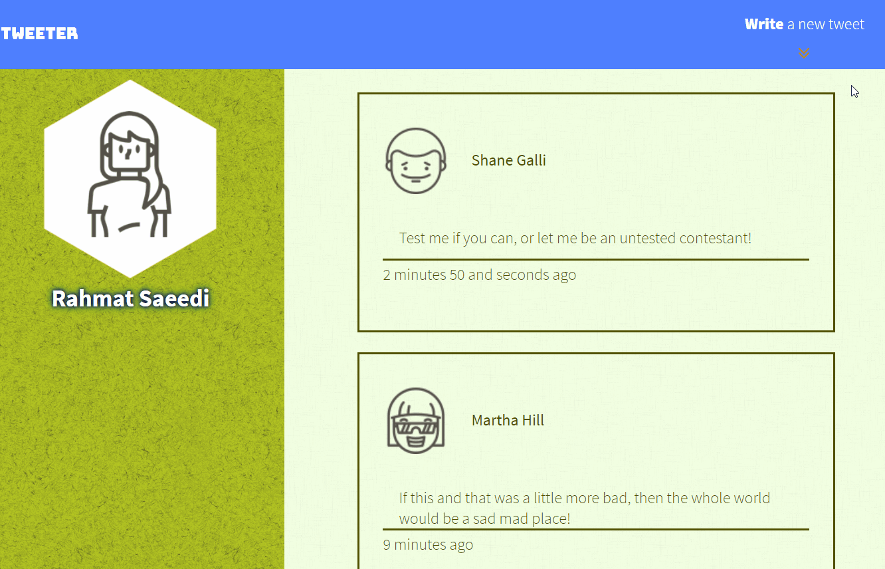
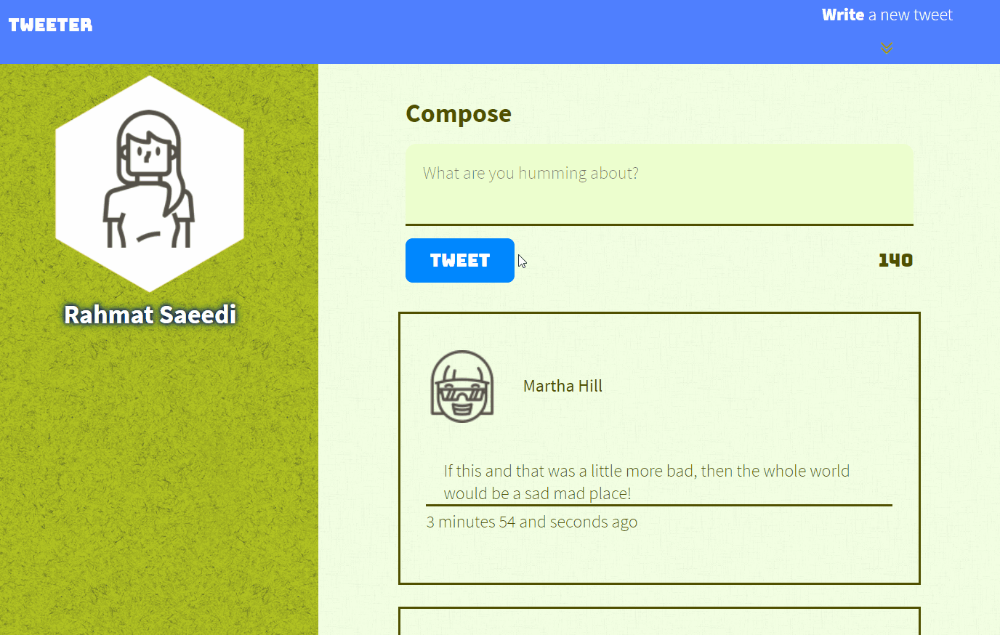
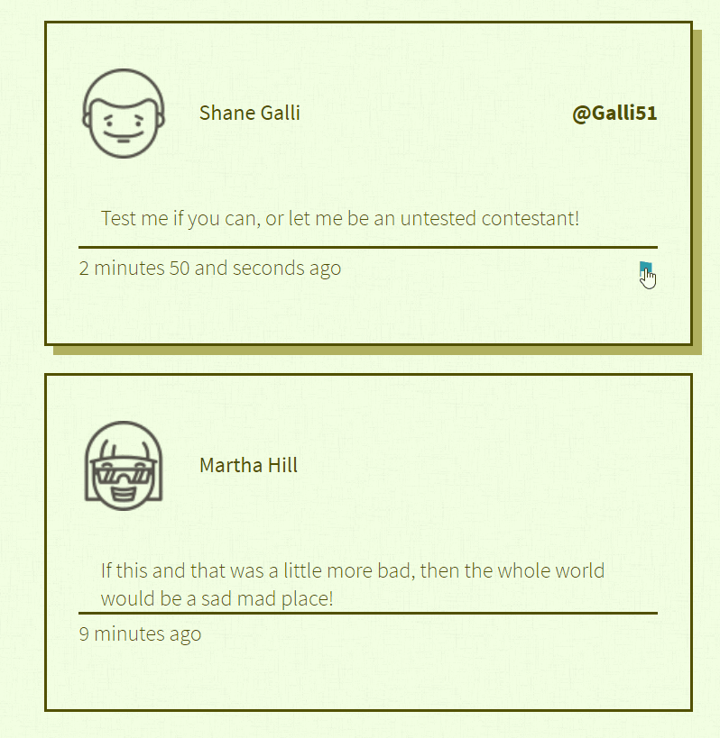
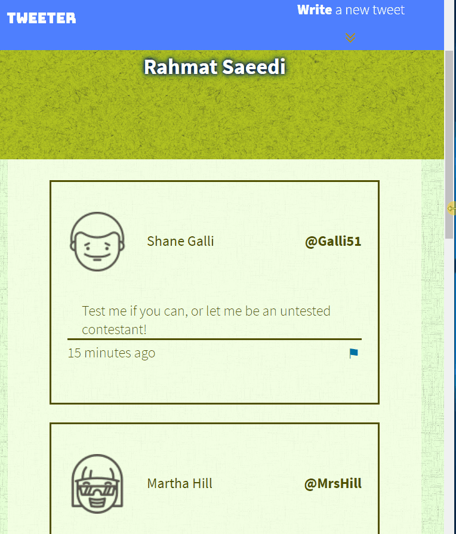

# Tweeter Project

A twitter clone project, built to learn front-end development skills, such as _HTML_, _CSS_, _JS_, _jQuery,_ and _AJAX_ and their back-end development skills such as _Node_, _Express_, and _MongoDB_.

## Getting Started
1. Install using the `npm install` command.
2. Start the web server using one of the following command:
    * `npm run local` in _development_ environment, or
    * `node server/index.js` in _production_ environment
3. Go to <http://localhost:80/> in your browser.

## Dependencies
- Express
- Node
- body-parser
- chance
- devDependencies
  - nodemon

# Documentation & Showcase
External libraries that were used were `jQuery 2.2.3`, `normalize 4.1.1`, and google fonts (`Bungee` and `Source Sans Pro`).


## Navigation & Navigation Toggler

Navigation bar is composed of a fixed-positioned and height `nav` element with two floating elements within it. One floating left (`id="logo"`) and the other right (`id="navToggler"`).
```html
<nav>
    <span id="logo">tweeter</span>
    <div id="navToggler">
    <span>
        <a>Write</a>
        a new tweet
    </span>
    <div>
        <div></div>
    </div>
    </div>
</nav>
```
The arrow was animated with css _keyframes_, where a _div_ of fixed size and background continously moves up and down via _transform: translateY_ property, as seen below.
```css
#navToggler > div {
  width: 35px;
  min-height: 35px;
  background-image: url("/images/icons/double-chevron-down.svg");
  background-repeat: no-repeat;
  animation: vTranslate 1.5s infinite ease-out;
}

@keyframes vTranslate {
  0%, 100% {
    transform: translateY(50%);
  }

  45% {
    transform: translateY(-20%);
  }
}
```
Sliding effect was achieved via jQuery.
```js
// Add event listener for Navbar toggle button
$('#navToggler').on('click', function(e) {
    $('#new-tweet').slideToggle();
    e.stopPropagation();
});
```
## Bottom Navigation

Simillar to the Top Nav bar, this is a fixed-positioned _div_ element at the bottom-right corner, with a _background-image_. The _div_ is only displayed when _scrollTop_ property is is over `700px`. Also, top navigation bar is hidden when the bottom one is displayed.
```css
/*************************
* Bottom of page scroller
*************************/
#scrollUp {
  background-image: url('/images/icons/arrow-up.svg');
  background-repeat: no-repeat;
  width: 100px;
  min-height: 100px;
  margin: 20px;
  position: fixed;
  bottom: 0;
  right: 0;
  z-index: 100;
  cursor: pointer;
  display: none;
}
```
```js
// bottom scroller 
$(window).scroll(function() {
    if ($(this).scrollTop() > 700) {
        $('#scrollUp').css('display', 'block');
        $('#navToggler').css('display', 'none');
    } else {
        $('#scrollUp').css('display', 'none');
        $('#navToggler').css('display', 'block');
    }
});

$('#scrollUp').on('click', function(e) {
    $('html, body').animate({scrollTop: 0}, 'fast');
    e.stopPropagation();
});
```
## Ajax Submission






## Moments ago
Rather than using `npm moments` library, an inhouse version of it was used, with the following outputs, based on the input `_date`, # ms from unix epoch:
  - `just now`: if less than first 3 seconds ago.
  - `{x} seconds ago`: if between 3 seconds to 60 seconds ago.
  - `{x} minutes  and {y} seconds ago`: if between 1 min to 6 min ago.
  - `{x} minutes ago`: if between 6 min to 60 min ago.
  - `{x} hours and {y} minutes ago`: if between 1h to 24h ago.
  - `{x} days and {h} hours ago`: if between 24h to 3days ago.
  - `{x} days ago`: if between 3 days to 1 month ago.
  - `{x} months ago`: if between 1 month to 12 month ago.
  - `{x} years ago`: if between over 12 monthes ago.


[LHLTweeter]: https://github.com/lighthouse-labs/tweeter


